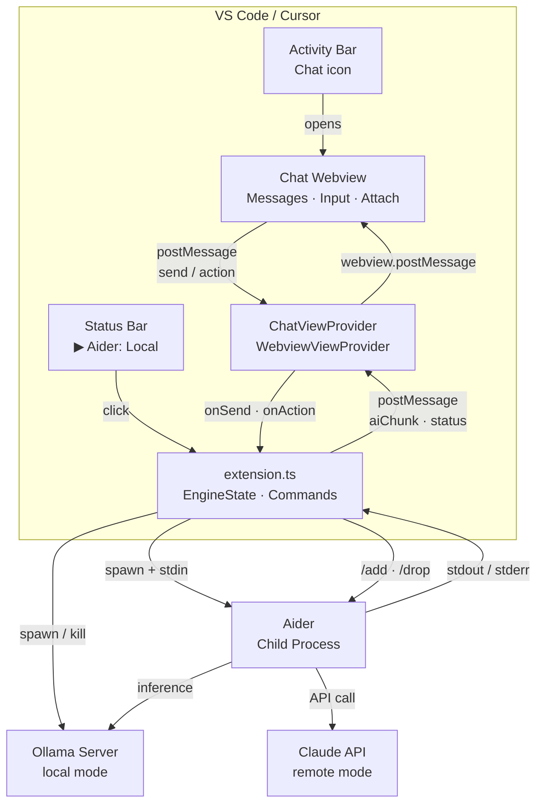
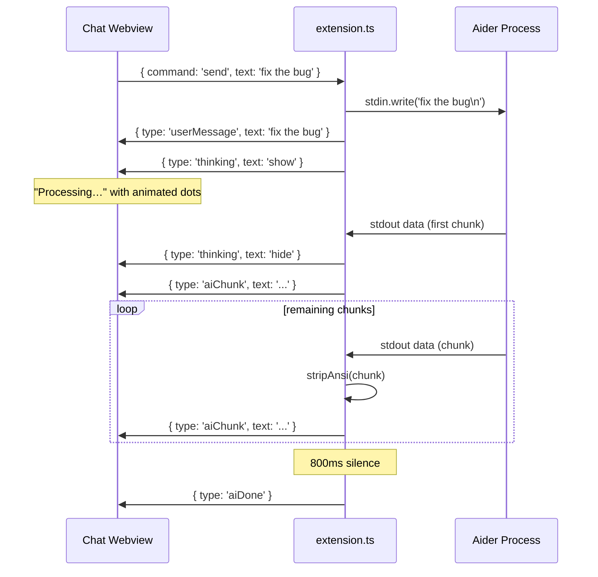
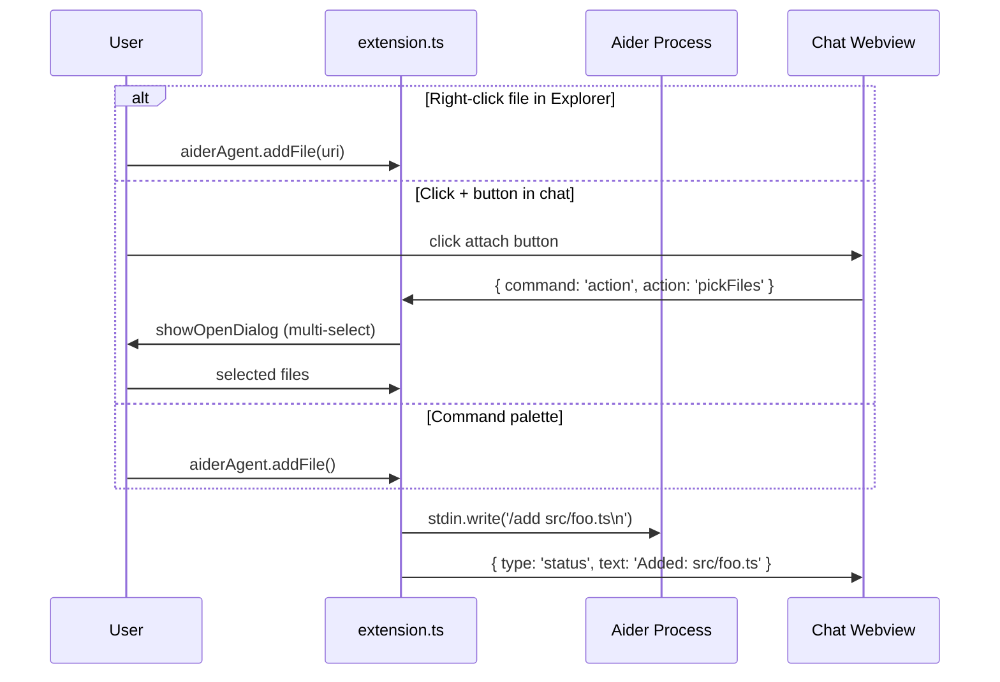
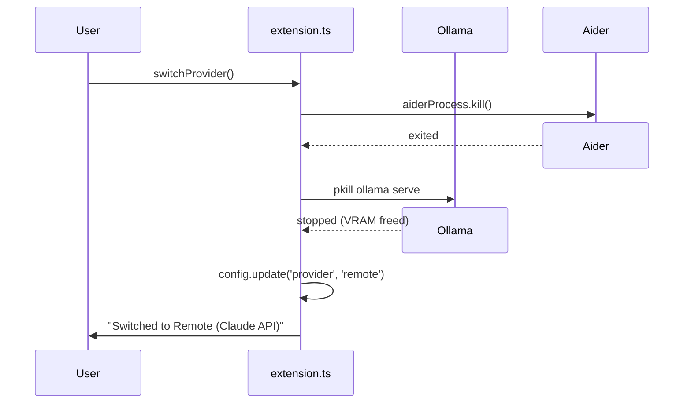
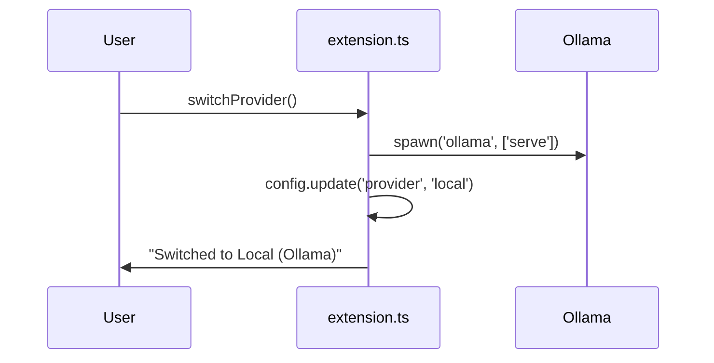

# Development Guide

Contributing to Aider Chat? This document covers the architecture, build process, testing, and CI/CD pipeline.

## Architecture

### File Structure

```
aider-chat/
├── package.json                  # Extension manifest, commands, settings, views
├── tsconfig.json                 # TypeScript config (ESNext, NodeNext)
├── eslint.config.mjs             # ESLint flat config with typescript-eslint
├── .env.example                  # Template for API keys (copy to .env)
├── .vscodeignore                 # Files excluded from VSIX package
├── .github/
│   └── workflows/
│       ├── ci.yml                # CI: compile, lint, test on push/PR
│       └── publish.yml           # Publish to VS Code Marketplace + Open VSX
├── .vscode/
│   └── settings.json             # Workspace defaults (model, provider, extra args)
├── src/
│   ├── extension.ts              # Activation, process management, command wiring
│   ├── chatViewProvider.ts       # WebviewViewProvider — chat UI + message protocol
│   └── test/
│       ├── extension.test.ts     # Integration tests (activation, commands, config)
│       └── chatViewProvider.test.ts  # Unit tests (message protocol, HTML, handlers)
└── dist/                         # Compiled output (gitignored)
```

### Component Diagram



### Message Flow: Chat



### Message Flow: File Context



### Provider Switch: Local → Remote



### Provider Switch: Remote → Local



### Ollama Lifecycle

Ollama is treated as a managed resource. The extension owns its lifecycle:

| Event | Ollama action |
|-------|--------------|
| Start engine (local) | `spawn('ollama', ['serve'])` — sets `OLLAMA_API_BASE` |
| Stop engine (local) | `kill` + `pkill -f 'ollama serve'` |
| Switch to remote | Kill Ollama immediately (free VRAM) |
| Switch to local | Start Ollama immediately |
| Extension deactivate | Kill if running |

## Project Layout

```
src/
├── extension.ts               # Entry point
│   ├── activate()             # Registers commands, status bar, chat view provider
│   ├── loadDotEnv()           # Reads .env file from workspace root
│   ├── startEngine()          # Spawns Aider (+ Ollama if local), sets OLLAMA_API_BASE
│   ├── stopEngine()           # Kills Aider (+ Ollama if local)
│   ├── switchProvider()       # Toggles local/remote, manages Ollama lifecycle
│   ├── handleChatInput()      # Writes user text to Aider stdin
│   ├── pipeToChat()           # Streams Aider stdout → chat view (ANSI-stripped)
│   ├── addFile() / removeFile()   # Sends /add and /drop to Aider stdin
│   └── pickFiles()            # Opens multi-file picker, sends /add for each
│
├── chatViewProvider.ts        # Sidebar webview
│   ├── resolveWebviewView()   # Builds HTML, wires message + action listeners
│   ├── addUserMessage()       # Posts user bubble to webview
│   ├── appendAiChunk()        # Streams AI text into current bubble
│   ├── markAiDone()           # Finalizes AI response bubble
│   ├── showThinking()         # Shows/hides "Processing…" indicator
│   ├── setProvider()          # Syncs provider dropdown state
│   └── showStatus()           # Adds centered status message
│
└── test/
    ├── extension.test.ts          # Integration: activation, commands, config defaults
    └── chatViewProvider.test.ts   # Unit: message protocol, HTML, send/action handlers
```

## Building & Testing

```bash
npm run compile    # Build once
npm run watch      # Rebuild on save
npm run lint       # ESLint check
npm run fix        # ESLint auto-fix
npm run test       # Compile + lint + run extension tests
npm run test:only  # Run tests without recompiling
npm run package    # Build a .vsix for local install
```

### WSL2 testing prerequisites

Running the extension test suite inside WSL2 requires system libraries for the Electron test host:

```bash
sudo apt-get install -y libnspr4 libnss3 libatk1.0-0 libatk-bridge2.0-0 \
  libx11-xcb1 libdrm2 libgbm1 libgtk-3-0 libasound2t64 xvfb
```

Then run tests under a virtual framebuffer:

```bash
xvfb-run -a npm run test:only
```

## CI / CD

Two GitHub Actions workflows live in `.github/workflows/`:

| Workflow | Trigger | What it does |
|----------|---------|--------------|
| **ci.yml** | Push / PR to `main` or `master` | Compile, lint, test (with `xvfb`), package VSIX, upload artifact |
| **publish.yml** | GitHub Release published | Everything in CI, then publish to VS Code Marketplace (`VSCE_PAT`) and Open VSX (`OVSX_PAT`) |

To set up automated publishing, add `VSCE_PAT` and `OVSX_PAT` as repository secrets in GitHub.
